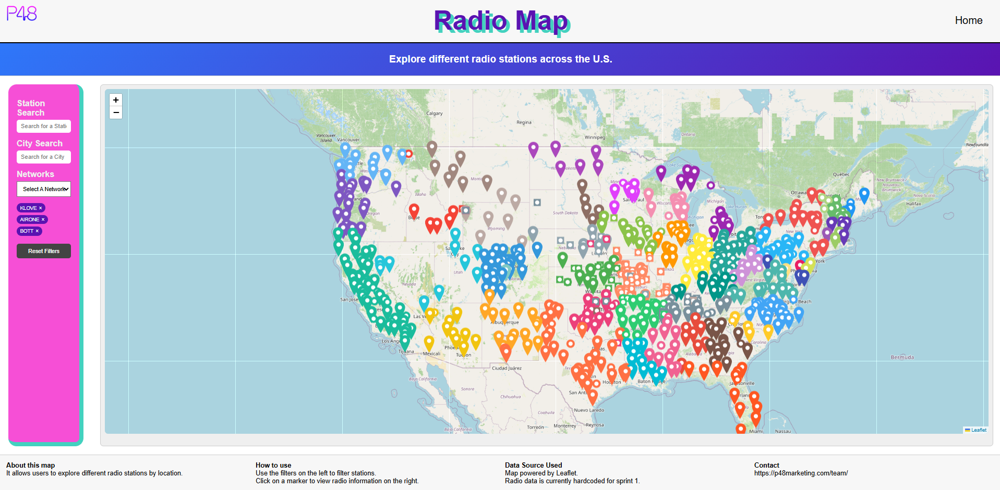
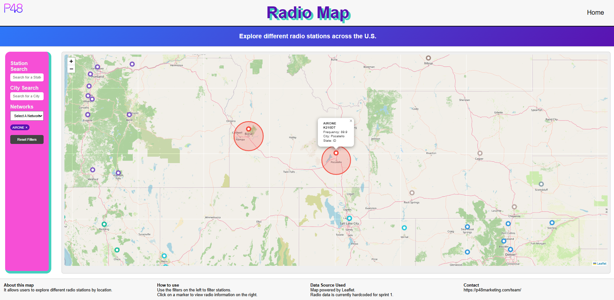
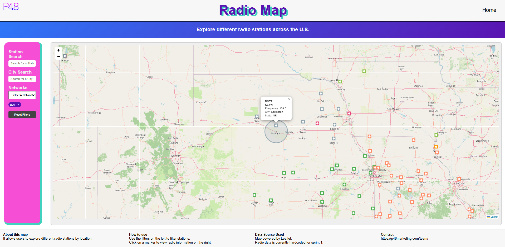

# P48 Marketing Radio Dashboard

This is a radio station dashboard built for **P48 Marketing**.  
The project helps users explore radio stations across the United States using an interactive map.

Users can search for stations, filter by network, click on map markers, and view station details like name, frequency, city, state, and network.

## Project Preview

## Features

- Interactive map built with Leaflet.js
- Clickable radio station markers
- Station search
- City search
- Network filters
- Broadcast radius circles
- Color-coded markers
- Auto zoom when a station is selected
- Simple layout with a sidebar and map
- Footer with map info, how-to-use notes, data source, and contact link

## What I Worked On

- Built the radio station map layout
- Added clickable markers with station info
- Added search and filter tools
- Added broadcast radius circles
- Helped make the dashboard easier to use
- Worked on the project in sprints with a small team

## Tools Used

- HTML
- CSS
- JavaScript
- Leaflet.js
- OpenStreetMap
- GitHub

## About the Project

This project was made to help P48 Marketing display radio station information in a clear and simple way.  
Instead of looking through a long list of stations, users can explore them on a map and find the stations they need faster.

## Website

P48 Marketing: https://p48marketing.com
